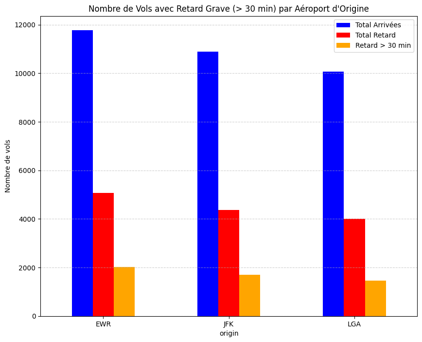
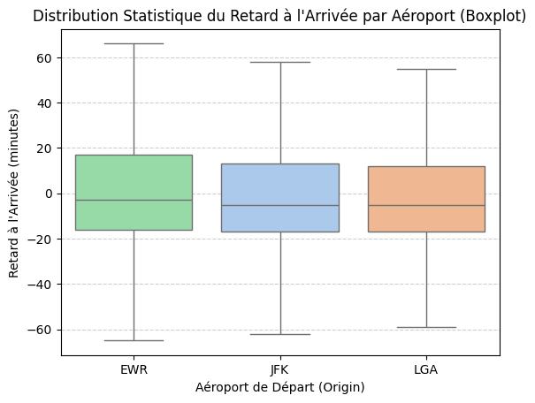
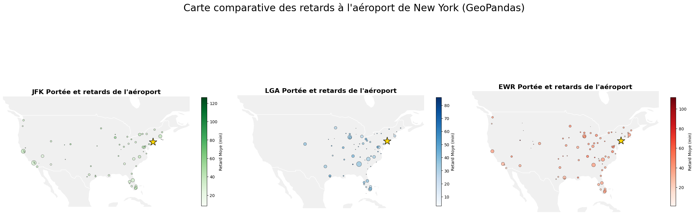

# ✈️ Analyse des Retards Aéroportuaires NYC 2013 / NYC Airport Delay Analysis

**Outils Utilisés / Tools Used:** Python, Pandas, Matplotlib, Seaborn, GeoPandas.

---

## 🇫🇷 Version Française

### 📊 Hypothèse 1 : Volume et Sévérité des Retards

Nous avons cherché à quantifier les retards en montrant le nombre absolu d'événements, spécifiquement les vols avec plus de 30 minutes de retard. L'objectif était de voir si un aéroport accumulait plus de "retards graves" que les autres.

**✅ Résultat 1**
L'analyse confirme que l'aéroport le plus touché, Newark (EWR), subit non seulement les retards moyens les plus longs, mais produit également le plus grand nombre de retards sévères. Le graphique à barres montre clairement que EWR dépasse JFK et LGA en volume de vols très retardés.

### 📈 Hypothèse 2 : Distribution Statistique

Cette analyse visait à montrer la distribution statistique des retards pour chaque aéroport en observant les médianes et les quartiles. Cela permet d'identifier quel aéroport présente la tendance moyenne la plus élevée au retard, au-delà des simples valeurs aberrantes.

**✅ Résultat 2**
Le Boxplot révèle que Newark (EWR) présente la moyenne de retard la plus élevée (≈9.3 minutes) et une médiane (−3.0 minutes) plus proche de zéro que les autres. Cela prouve que la performance globale de EWR est la moins ponctuelle par rapport à JFK et LGA.

### 🌍 Hypothèse 3 : Contexte Géographique

Nous avons supposé que l'aéroport le plus en retard pourrait avoir un réseau de routes plus complexe ou plus étendu géographiquement. L'objectif était d'apporter un contexte spatial à notre hypothèse principale en visualisant les destinations.

**✅ Résultat 3**
La carte comparative met en évidence l'étendue du réseau de destinations pour chaque aéroport. Elle suggère que la complexité du réseau de EWR contribue potentiellement à sa vulnérabilité accrue aux retards par rapport à ses voisins.

---

## 🇺🇸 English Version

### 📊 Hypothesis 1: Volume and Severity of Delays

We searced to quantify delays by showing the absolute number of events, specifically flights with more than 30 minutes of delay. The goal was to see if one airport accumulated more "severe delays" than the others.

**✅ Result 1**
The analysis confirms that the most affected airport, Newark (EWR), not only suffers the longest average delays but also produces the highest number of severe delays. The bar chart clearly shows that EWR exceeds JFK and LGA in the volume of significantly delayed flights.

### 📈 Hypothesis 2: Statistical Distribution

This analysis aimed to show the statistical distribution of delays for each airport by observing medians and quartiles. This helps identify which airport shows the highest average tendency for delays, beyond just outliers.

**✅ Result 2**
The Boxplot reveals that Newark (EWR) has the highest average delay (≈9.3 minutes) and a median (−3.0 minutes) closer to zero than the others. This proves that EWR's overall performance is the least punctual compared to JFK and LGA.

### 🌍 Hypothesis 3: Geographical Context

We hypothesized that the airport with the most delays might have a more complex or geographically extensive route network. The objective was to provide spatial context to our main hypothesis by visualizing destinations.

**✅ Result 3**
The comparative map highlights the extent of the destination network for each airport. It suggests that the complexity of EWR's network potentially contributes to its increased vulnerability to delays compared to its neighbors.